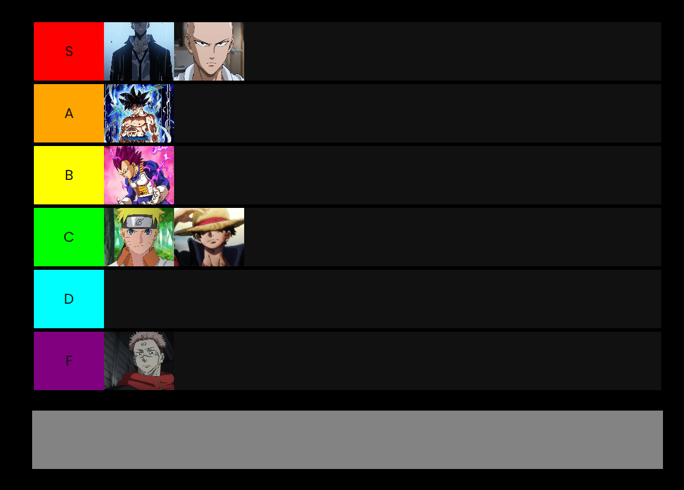

# 🎖 Tier List Generator

## 📌 Descripción
Tier List Generator es una aplicación web que permite crear y personalizar **tier lists** de forma sencilla e interactiva. Perfecto para clasificar desde videojuegos hasta personajes de series, comidas, deportes o cualquier otra cosa.  

## 🚀 Características
- 🎨 **Personalización total**: Modifica los nombres y colores de cada nivel.  
- 🖼 **Soporte de imágenes**: Añade imágenes para visualizar mejor los elementos.  
- 🖱 **Drag & Drop**: Organiza los elementos fácilmente con solo arrastrar y soltar.  
- 💾 **Guardado y exportación**: Guarda tu tier list para compartirla o modificarla más tarde.  
- 🌐 **Basado en web**: No requiere instalación, solo abre y usa.  

## 🛠 Tecnologías utilizadas
- HTML, CSS, JavaScript  
- [Si usaste un framework o librerías, agrégalo aquí]  

## 🎮 Cómo usar
1. Carga o añade los elementos que deseas clasificar.  
2. Arrástralos a la categoría correspondiente.  
3. Personaliza los colores y nombres de las categorías.  
4. Guarda o exporta tu tier list.  
